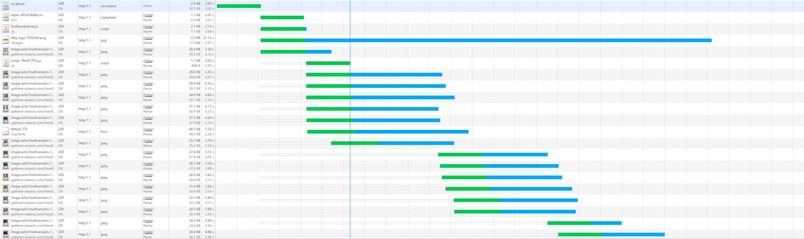
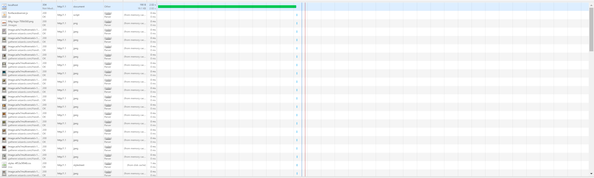

# Performance Matters @cmda-minor-web · 2018-2019

## Introduction
In this course we will convert the client side web application made earlier at the OBA to a server side rendered application. We are also going to implement a series of optimisations to improve the performance of the application. Finally we ensure that the application is available offline.


## Table of Contents

- [Installation](#installation)
- [Features](#features)
- [API](#api)
- [Optimisations](#optimisations)
  - [First view](#first-view)
    - [Compression](#compression)
    - [Fontface Observer](#fontface-observer)
  - [Repeat view](#repeat-view)
    - [Caching](#caching)
    - [Revisioning](#revisioning)
- [Service Worker](#service-worker)
  - [Offline Page](#offline-page)
- [Checklist](#checklist)
- [License](#license)

## Installation
1. Open your terminal
2. Change the directory to a folder in which you want to place the files
```bash
cd /~path
```
3. Clone the repository (you're going to need [Git](https://www.linode.com/docs/development/version-control/how-to-install-git-on-linux-mac-and-windows/))
```bash
git clone https://github.com/JimvandeVen/performance-matters-1819
```
4. Run 
```bash
npm Install
```
5. Run 
```bash
npm run watch
```
6. Enjoy the application

## Features

My application is a search engine wherein you can find all existing magic the gathering cards. This is done with a small form with a few fields you need to fill in. After filling in the fields you get a selection of the cards that fall within your chosen filters. Up to 100 cards are shown. These cards are requested from an API where more than 10.000 cards exist. The goal is to search through those cards and find the ones you are looking for.

## API

The [API](https://docs.magicthegathering.io/) I'm using is the unofficial REST interface for Magic: The Gathering. This API returns a maximum of 100 cards per call. The data you get is JSON. There is a maximum of 5000 calls per hour. The API returns data in the JSON format. 

## Optimisations

### First view

#### Compression
I used [Compression](https://www.npmjs.com/package/compression) to compress files to GZIP.

Before Compression
```
CSS time 23.25ms
JS time 57,19ms
```
After Compression
```
CSS time 12.68ms
JS time 36.19ms
```

#### Fontface Observer
Fontface Observer uses a small client side javascript file to check if the custom fonts are loaded yet. If so it adds a class to your html that uses the custom fonts. Before the fonts are loaded the other fonts in your font-stack are used. This way the user always sees the text on your website. Even before the custom fonts are loaded.

### Repeat view

#### Caching
With the `setHeader()` function you can set the cache-control for your headers. This way you can add set the amount of time the  you can set the amount of time the browser will cache your files. This makes repeat views much, much faster.

Before Caching:


After Caching:


### Revisioning

But Caching brings us to the next problem. What if the css has changed? How will you serve the new css instead of the cached one? Enter Revisioning.

For revisioning I used `task/revisioning.js` that is run by a command in my build step. In this file create a `manifest.json` file where I have an object that holds the paths to the revisioned css/js files. It also creates those revisioned files. Then in my views I create a variable path to my files. This variable is looked up from the manifest, file and passed along by my server. 

## Service Worker
The service worker I installed takes my static files an saves them in the cache. This enables the user to still visit previously visited pages. Or those saved in the install sequence of the service worker. I also save my static images in the service worker cache. This greatly reduces load times for repeat views and is a great fallback for when something goes wrong with either the server or the client side cache.

### Offline Page

The service worker also reroutes the user to an offline page when no internet is available. This makes for a softer landing.


## Checklist
- [x] Rebuild client side app to server side app
- [X] Add Compression
- [x] Add Fontface Observer
- [X] Set cache headers
- [x] Implement Revisioning
- [X] Add Service Worker
- [X] Add Offline Page

## License 
See the [LICENSE file](https://github.com/Mennauu/web-app-from-scratch-18-19/blob/master/LICENSE) for license rights and limitations (MIT).

