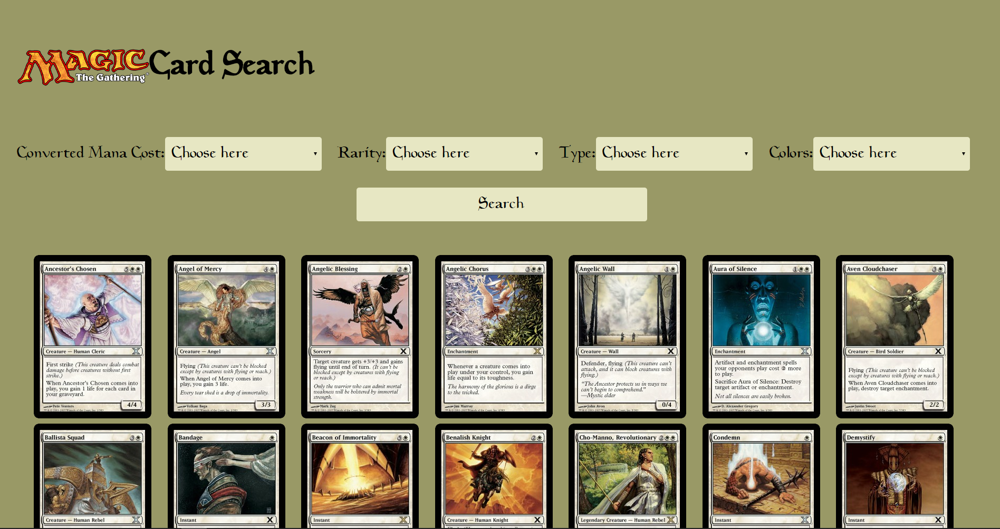

# Performance Matters @cmda-minor-web · 2018-2019

## Introduction
In this course we will convert the client side web application made earlier at the OBA to a server side rendered application. We are also going to implement a series of optimisations to improve the performance of the application. Finally we ensure that the application is available offline.




## Table of Contents

- [Installation](#installation)
- [Features](#features)
- [API](#api)
- [Optimisations](#data)
  - [First view](#first-view)
    - [Compression](#compression)
    - [Fontface Observer](#fontface-observer)
  - [Repeat view](#repeat-view)
    - [Caching](#caching)
    - [Results](#results)
- [Checklist](#checklist)
- [License](#license)

## Installation
1. Open your terminal
2. Change the directory to a folder in which you want to place the files
```bash
cd /~path
```
3. Clone the repository (you're going to need [Git](https://www.linode.com/docs/development/version-control/how-to-install-git-on-linux-mac-and-windows/))
```bash
git clone https://github.com/JimvandeVen/performance-matters-1819
```
4. Run 
```bash
npm Install
```
5. Run 
```bash
npm run watch
```
6. Enjoy the application

## Features

My application is a search engine wherein you can find all existing magic the gathering cards. This is done with a small form with a few fields you need to fill in. After filling in the fields you get a selection of the cards that fall within your chosen filters. Up to 100 cards are shown. These cards are requested from an API where more than 10.000 cards exist. The goal is to search through those cards and find the ones you are looking for.

## API

The [API](https://docs.magicthegathering.io/) I'm using is the unofficial REST interface for Magic: The Gathering. This API returns a maximum of 100 cards per call. The data you get is JSON. There is a maximum of 5000 calls per hour. The API returns data in the JSON format. 

## Optimisations

### First view

#### Compression
I used [Compression](https://www.npmjs.com/package/compression) to compress files to GZIP.

Before Compression
```diff
+ CSS time 23.25ms
+ JS time 57,19ms
```
After Compression
```diff
+ CSS time 12.68ms
+ JS time 36.19ms
```

#### Fontface Observer


### Repeat view

#### Unique hash digits

#### Caching


#### Results

HET BUILDEN VAN DE HELE APP VIA NPM

- Minification
- file revisioning (rev-manifest)
- Brotli ipv GZIP
- precompression (Static site)
- img revision tag (304 - 200)
- srcset and sizes attributes 
- Picture html tag (client hints) - webp met fallbacks
- Resource hints
- DNS-PREFETCH
- link preconnect, prefetch, preload, prerender
- font subsetting
- font rendering controls (font-display: swap)
- Reflow verminderen door op de fallback font line-height en letter-spacing te plaatsen (Font style Matcher)
- fontFaceObserver (add class async (after font is loaded)) with a cookie and class
- Defer, async scripts
- Je kan styles asynchroon inladen (LoadCSS)
- Critical CSS - minimum css nodig (lijn trekken) -->

## Checklist
- [x] Rebuild client side app to server side app
- [x] Add Handlebars
- [x] Minifiy files
- [X] Add unique hash digits to css and javascript files
- [X] Add (pre)compression
- [X] Set cache headers (for caching)


## Credits


## License 
See the [LICENSE file](https://github.com/Mennauu/web-app-from-scratch-18-19/blob/master/LICENSE) for license rights and limitations (MIT).

